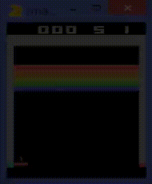

# Deep-Q-Network--Breakout

Keras implementation of a Deep-Q-Network that can play Atari Breakout at a performance above human-level.

# How it Works

The network learns to play video games by using Q-learning, which is a model-free reinforcement learning algorithm. In other words, it uses an algorithm that uses trial and error to learn an action-selection policy that will maximize the expected value of the total reward (also known as the return). 

The Q-value of a (state, action) pair is determined using the Bellman equation:


Basically, to find the Q-value of a state-action pair, (s, a), take the sum of all possible next states and rewards, find the state-action transition probabilities for each possible action, then multiplying it by the immediate reward for taking that action plus the future Q-value of the next state, given that you take the action that maximizes its Q-value. A state-action transition probability is the probability of landing in state, s', and receiving reward, r, given that I started in state, s, and took action, a.

(Fun fact: The Q in Q-value stands for quality)

The way Q-learning works is that the agent has a variable, **ε** (epsilon), that represents the ratio of exploration to exploitation. Exploring means taking a random action while exploiting means taking the action that will maximize the Q-value of that state. Over time, ε decays to the hyperparameter, minimum ε. 

```python

epsilon = 1.0
epsilon_min = 0.1
epsilon_decay = (epsilon - epsilon_min) / numExplorationSteps

if random_number > epsilon: 
    return some random action
`else:
    return action that maxamizes the Q-function

if epsilon > epsilon_min:
    epsilon = epsilon - epsilon_decay
else:
    pass

```

This is useful because if numExplorationSteps is set to a very large number, the algorithm will learn the Q-values of actions in all sorts of states that take a lot of quality moves to reach. For example, in the second animation in the demo below, the agent is playing in a state that only happens late in the game. 

After every step (or action) taken by the agent, it will save the to-from pair to a deque called `experience_memory`. This object stores the reward, `r`, received after taking some action, `a`, in state, `s`, which resulted in state, `s'`. This will come in handy during experience replay.

In my program, they are the following variables: `state`, `action`, `reward`, `done`, `next_state`. 

`done` is a boolean that is True if the action taken resulted in losing the game (which means that `state` is a terminal state). Otherwise, `done` is False, meaning the agent could still continue playing. 

**Experience replay** is is a temporal difference learning method that uses the previous states, actions, rewards, and next states stored in the memory to learn to maximize a Q-function. The program learns the real Q-values of every state-action pair by using this function:


Source: [Wikipedia](https://en.wikipedia.org/wiki/Q-learning#Algorithm)

Hyperparameters:
- **α (alpha)** - Learning rate
- **γ (gamma)** - Discount factor

The next states and future rewards are super important because the agent's goal is to maximize the return (sum of all rewards). The agent will learn to choose an action with a low immediate reward but high long-term reward than an action with a high immediate reward and a low long-term reward. The hyperparameter gamma, **γ** (also known as the discount factor), is what makes this possible. Gamma is the amount the algorithm discounts future rewards. If you seek high immediate rewards, you would set gamma to be a small number. Vice versa.

The network learns new Q-values by subtracting its prediction by the actual value and squaring it. In other words, DQNs typically use MSE (mean-squared error) loss functions. After the loss is computed, the network performs backpropagation which is a process that uses derivatives of the activation functions to adjust the weights/biases. Then, each weight/bias is subtracted by the learning rate alpha, **α**, multiplied by the error of that single activation node had in computing the predicted value. This process is very complicated, but Professor Andrew Ng has an excellent Coursera course explaining how this learning process works.

After many, many steps, the agent will learn to maximize the reward through the law of large numbers. This is because as experience in the memory increases, any stochasticity in the environment will become apparent to the agent. Thus, the agent will learn the state-transition probabilities and will be able to use them to solve/beat the environment.

Sadly, my computer kept crashing at around 650,000 steps so I was not able to obtain the optimal weights. But if you run this algorithm on a computer with more RAM, it will be able to converge.

This is the DQN algorithm in Pseudocode:


<br>

# Demo

Here is an animation of the network playing towards the start of the training process:

<p align="center"> 

</p>

This is the network's performance towards the end of the training process. As you can see, it has learned that keeping the ball above the paddle will maxamize the return.

<p align="center"> 

</p>

This animation shows the network at the end of the training. It also shows the impact of having a high discount factor (discounts the future very little) has on the algorithm. As you can see, the agent aims to break the blocks on the left so it can get the ball on top of the blocks. I find it fascinating that the agent found a cool loophole like this to maximize the return.

<p allign="center">

</p>

# Requirements to run

Install these python libraries before running.
- gym
- gym[atari]
- tensorflow
- keras
- h5py
- numpy
- pickle (optional)

# How to use

Use the argument.py file to modify the arguments to your liking.

Then, run the main.py file by entering the command, `python main.py` into the terminal.

# References

- [OpenMind Paper - "Human-level control through deep reinforcement learning"](http://web.stanford.edu/class/psych209/Readings/MnihEtAlHassibis15NatureControlDeepRL.pdf)
- [MIT Deep Reinforcement Learning Lecture](https://www.youtube.com/watch?v=QDzM8r3WgBw&t=2262s&ab_channel=LexFridman)
- [Andrew Ng - Computational Graphs](https://www.youtube.com/watch?v=nJyUyKN-XBQ&ab_channel=Deeplearning.ai)
- [Sutton/Barto Reinforcement Learning Textbook](http://web.stanford.edu/class/psych209/Readings/SuttonBartoIPRLBook2ndEd.pdf)
- [Lecture 16 - Independent Component Analysis & RL | Stanford CS229: Machine Learning (Autumn 2018)](youtube.com/watch?v=YQA9lLdLig8&list=PLoROMvodv4rMiGQp3WXShtMGgzqpfVfbU&index=16&ab_channel=stanfordonline)
- [Lecture 17 - MDPs & Value/Policy Iteration | Stanford CS229: Machine Learning (Autumn 2018)](https://www.youtube.com/watch?v=d5gaWTo6kDM&list=PLoROMvodv4rMiGQp3WXShtMGgzqpfVfbU&index=17&ab_channel=stanfordonline)
